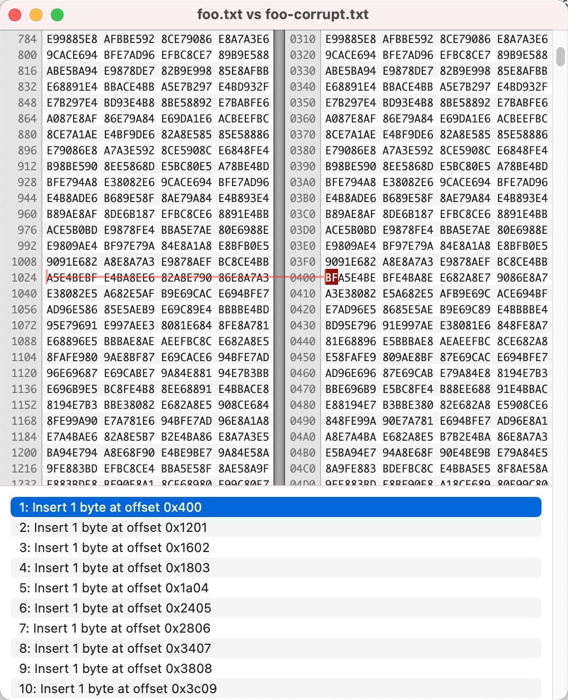

# bash-5_1_8_long_var_corrupt
bash 5.1.8 long variable corrupt problem

This is a project to reproduce bash 5.1.8 (alpine linux 3.15.0) long variable value corrupt issue.

## Environment

OS: Alpine linux 3.15.0

Bash version: GNU bash, version 5.1.8(1)-release (x86_64-alpine-linux-musl)

## Problem

A UTF-8 encoded file containing a lot of Chinese characters, file size ~35K.

```bash
file foo.txt
foo.txt: UTF-8 Unicode text, with very long lines, with no line terminators
```

A test script read content from `foo.txt` and assign the content to a variable,
and then check md5sum for that variable. See [test.sh](test.sh)

**Sometimes**, the md5sum check failed.

Output variable value to `foo-corrupt.txt` when check fail, compare it with `foo.txt`, 
found that a random byte are inserted into multiple positions.(I use "Hex friend" on 
Mac to do the compare work).



## Reproduce step

build docker image:

```bash
./build.sh
```

run docker image:

```bash
./loop-run-docker.sh
```

output:

```bash
Docker run round 1
succeed

Docker run round 2
failed

Docker run round 3
succeed

Docker run round 4
succeed

Docker run round 5
failed
```

## Fix

This bug is fixed at patch 14, see [this][1], [this][2] and [this][3].

Dockerfile-fix provide Bash 5.1.16, which solves the problem.

Run `build-fix.sh` to build the fixed docker image. 

Run `loop-run-docker-fix.sh` to verify the fix.

## Reference

相关文章：https://chanjarster.github.io/post/bash-long-var-corrupt/

[1]: https://savannah.gnu.org/patch/?10035
[2]: https://ftp.gnu.org/gnu/bash/bash-5.1-patches/bash51-014
[3]: https://lists.gnu.org/archive/html/bug-bash/2022-01/msg00009.html